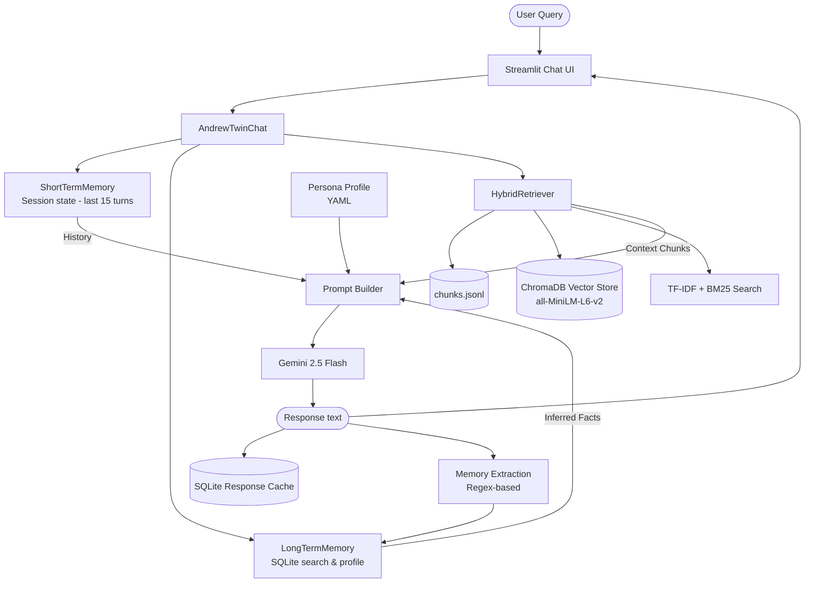

# Deep Repository Analysis: Andrew Ng Digital Twin

This document provides a comprehensive architectural and code-level analysis of the **Andrew Ng Digital Twin** project. It details how the current system orchestrates Retrieval-Augmented Generation (RAG), short-term and long-term memory, persona prompting, and user interface elements, along with proposed directions for enhancement.

---

## 1. System Architecture & Data Flow

The digital twin combines a Streamlit front-end with an orchestration layer that integrates memory stores and a hybrid retriever. The final generation is executed via Google's Gemini API, with caching and fallback layers built in.

---

## 2. Component Directory Breakdown

Here is the role of each directory in the workspace:

### 🖥️ User Interface & Orchestration
*   **[app/main.py](file:///d:/Main%20Files%20%28Arnav%29/College/AIMS/Assignments/DigitalTwin/app/main.py)**: The Streamlit application entry point. It manages session state (messages, chat orchestrator instance), renders the chat interface, details retrieved sources and memories in collapsible expanders, and shows a profile summary/memory log in the sidebar.
*   **[app/chat.py](file:///d:/Main%20Files%20%28Arnav%29/College/AIMS/Assignments/DigitalTwin/app/chat.py)**: The orchestrator class `AndrewTwinChat`. It manages API keys, coordinates retrieval and memory lookups, handles generation calls, saves response caches, implements fallback logic (OpenAI and rule-based fallback sentence synthesis), and updates short-term/long-term memory.

### 🧠 Memory Layer
*   **[memory/short_term.py](file:///d:/Main%20Files%20%28Arnav%29/College/AIMS/Assignments/DigitalTwin/memory/short_term.py)**: Simple list-based message cache (`ShortTermMemory`) capped at the last 15 messages.
*   **[memory/long_term.py](file:///d:/Main%20Files%20%28Arnav%29/College/AIMS/Assignments/DigitalTwin/memory/long_term.py)**: Persistent SQLite-backed fact storage (`LongTermMemory`). It attempts to automatically "learn" facts from user queries using regex matching (e.g. name, goals, interests) and ranks them using a token-overlap lookup.

### 🔍 RAG Ingestion & Retrieval
*   **[rag/chunking.py](file:///d:/Main%20Files%20%28Arnav%29/College/AIMS/Assignments/DigitalTwin/rag/chunking.py)**: Implements sliding window word-based token segmentation.
*   **[rag/ingest.py](file:///d:/Main%20Files%20%28Arnav%29/College/AIMS/Assignments/DigitalTwin/rag/ingest.py)**: Iterates over `.txt` files in `data/raw/`, cleans transcription artifacts (like timestamps), and writes chunks of length 650 with overlap 150 into a unified JSONL corpus (`data/processed/chunks.jsonl`).
*   **[rag/retrieval.py](file:///d:/Main%20Files%20%28Arnav%29/College/AIMS/Assignments/DigitalTwin/rag/retrieval.py)**: Implements hybrid retrieval.
    *   **Dense Phase**: SentenceTransformers `all-MiniLM-L6-v2` with ChromaDB (if installed); falls back to a custom Python-native sparse cosine TF-IDF matrix.
    *   **Keyword Phase**: `rank_bm25` (if installed) or fallback token matching.
    *   **Scoring & Boosting**: Normalizes scores and adds a metadata boost for query matches targeting specific topics, title keywords, or speakers.
    *   **Reranking**: Scores candidates using word overlap and a length penalty.
*   **[rag/online_sources.py](file:///d:/Main%20Files%20%28Arnav%29/College/AIMS/Assignments/DigitalTwin/rag/online_sources.py)**: Defines a registry of online Andrew Ng files (PDFs, publications pages, transcripts) and downloads/extracts text to supplement the raw corpus.
*   **[rag/reranker.py](file:///d:/Main%20Files%20%28Arnav%29/College/AIMS/Assignments/DigitalTwin/rag/reranker.py)**: Provides a simple local overlap-scoring utility.

### 🎭 Persona Definition
*   **[persona/andrew_ng_profile.yaml](file:///d:/Main%20Files%20%28Arnav%29/College/AIMS/Assignments/DigitalTwin/persona/andrew_ng_profile.yaml)**: Declares Andrew Ng's teaching philosophy, communication constraints, reasoning guidelines, and topics/tones to avoid (e.g. sarcasm, unsupported claims).
*   **[persona/prompt_builder.py](file:///d:/Main%20Files%20%28Arnav%29/College/AIMS/Assignments/DigitalTwin/persona/prompt_builder.py)**: Dynamically binds the system persona, long-term memory facts, RAG contexts, short-term history, and instructions into a final structured prompt for the Gemini LLM.

---

## 3. Notable Architectural Patterns

### 1. Robust Offline Fallbacks
If the Gemini API key is missing or encounters a rate-limit block, the orchestrator degrades gracefully:
*   It checks for an OpenAI fallback config (`FALLBACK_LLM_PROVIDER`, `OPENAI_API_KEY`).
*   If no remote model is available, it synthesizes an answer directly from source documents by looking up sentences that overlap with the query keywords (`_synthesise_offline_answer`).

### 2. Local-Only Fallbacks for Embeddings & Keywords
To keep setup straightforward, `HybridRetriever` is written dynamically:
*   If `numpy`, `scikit-learn`, `chromadb`, or `sentence-transformers` fail to load, the code does not crash. It instead switches to a pure-Python TF-IDF and keyword similarity index.

### 3. Immediate SQLite Response Cache
To prevent redundant API bills and speed up recurring questions, `AndrewTwinChat` checks an SQLite database (`memory/response_cache.sqlite`) to see if an identical prompt hash already has a generated answer.

---

## 4. Key Limitations & Bugs Identified

> [!WARNING]
> ### 1. API Key Parsing Bug
> In the `.env` file, the keys are named `GEMINI_API_KEY1`, `GEMINI_API_KEY2`, and `GEMINI_API_KEY3`.
> However, [app/chat.py](file:///d:/Main%20Files%20%28Arnav%29/College/AIMS/Assignments/DigitalTwin/app/chat.py#L59-L63) only looks for a comma-separated environment variable `GEMINI_API_KEYS` or a single `GEMINI_API_KEY`.
> Consequently, **none of the configured API keys in the `.env` file are currently parsed or used**, causing the app to immediately fall back to offline mode.

> [!CAUTION]
> ### 2. Fragile Regex Memory Extraction
> In [memory/long_term.py](file:///d:/Main%20Files%20%28Arnav%29/College/AIMS/Assignments/DigitalTwin/memory/long_term.py#L70-L80), extraction rules rely entirely on static, case-sensitive regex patterns like `I am learning ([^.?!]+)`.
> If the user says:
> *   *"I am currently studying convolutional networks"* -> **Fails to extract**
> *   *"My main objective is to master deep learning"* -> **Fails to extract**
> *   *"I prefer building projects in PyTorch"* -> **Saves preference, but misses details if phrased differently**
>
> This greatly limits the system's ability to maintain a natural, evolving user profile across conversation sessions.

> [!IMPORTANT]
> ### 3. Heavy Local Dependencies
> By default, the dense vector store uses a local `SentenceTransformer("all-MiniLM-L6-v2")` model.
> Running this model locally on CPU takes significant startup time and processing overhead. As seen in test execution, even importing and initializing these modules can take up to 60 seconds.

---

## 5. Roadmap of Recommended Improvements

We can systematically improve the digital twin across these fronts:

| Area | Feature | Current State | Proposed Solution |
| :--- | :--- | :--- | :--- |
| **Bug Fix** | API Key Loader | Doesn't recognize `GEMINI_API_KEY1`, `2`, `3` | Update [app/chat.py](file:///d:/Main%20Files%20%28Arnav%29/College/AIMS/Assignments/DigitalTwin/app/chat.py) to automatically look for indexed patterns `GEMINI_API_KEY\d+` and aggregate them. |
| **Memory** | LLM-based Fact Extraction | Static regex matching | Set up a lightweight asynchronous LLM extractor to scan turns for name, context, and preferences. |
| **Memory UI** | Memory Management Panel | Read-only in Streamlit sidebar | Add interactive delete buttons or a memory-editor card in the sidebar so users can manage what the twin remembers. |
| **RAG** | Cloud Embeddings option | Local SentenceTransformers | Support Google's `text-embedding-004` API to offload embedding compilation and speed up retrievals. |
| **UI/UX** | Premium Styling & Score Plotting | Standard Streamlit layout | Add custom CSS, a unified dark theme, cleaner conversational bubble layouts, and visualize source relevance scores. |
