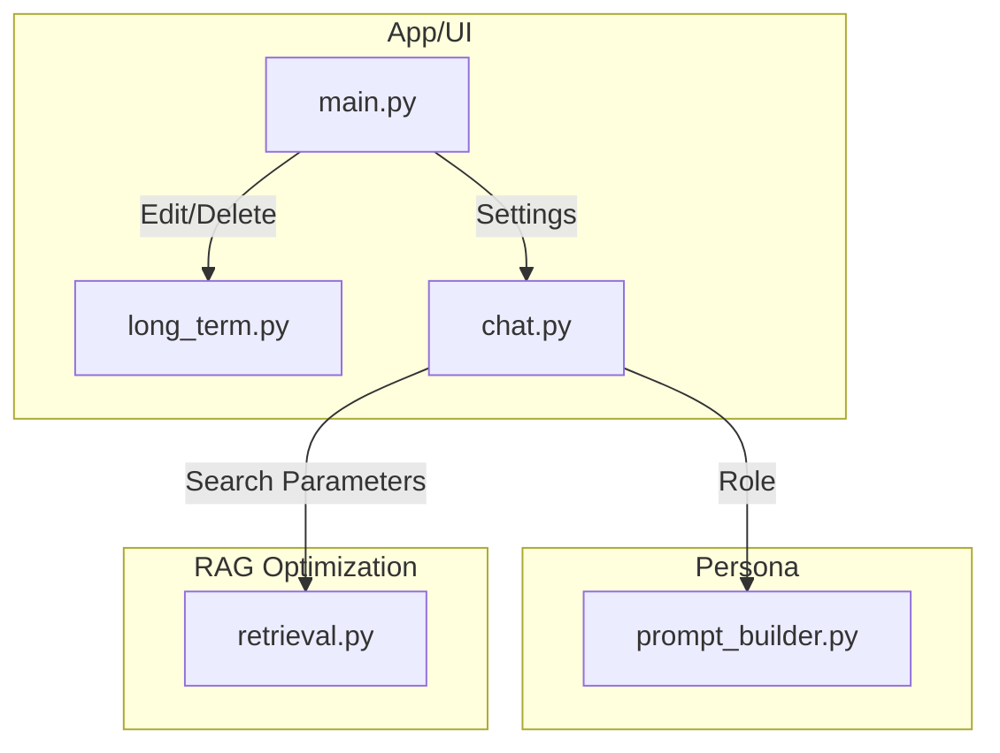

# Implementation Plan: Memory Control & Adaptive Persona Digital Twin

This plan outlines the design, files affected, code updates, and verification protocols for introducing interactive memory manipulation, profession-based persona adaptivity, token-saving retrieval optimizations, and custom CSS styling.

---

## 1. Goal Description
The objective is to upgrade the Andrew Ng Digital Twin from a read-only teaching assistant to a highly customizable personal mentor. 
Key outcomes:
*   **Memory Control**: Users can add, edit, or delete stored facts.
*   **Profession-Based Adaptivity**: Andrew's communication level and teaching style adjusts dynamically based on whether the user is a *Student*, *Engineer*, *Researcher*, or *Executive*.
*   **Token Efficiency**: Minimize LLM prompt tokens by pruning irrelevant RAG contexts.
*   **UI Modernization**: A premium CSS makeover of the Streamlit interface.
*   **Bug Resolution**: Repair the `.env` API keys loader.

---

## 2. User Review Required

> [!IMPORTANT]
> ### 1. Default Token-Saving Thresholds
> To reduce LLM prompt token costs, we propose decreasing the default RAG chunk parameter `top_k` from `7` to `4` (saving ~2,000 tokens per turn) and adding a minimum score threshold of `0.2` (ignoring low-relevance chunks). 
> Let us know if you want these limits to be dynamic or user-adjustable in the UI.

> [!TIP]
> ### 2. Persona Customization Logic
> Rather than modifying the main YAML file, we will keep the core `andrew_ng_profile.yaml` static and inject dynamic modifiers in `prompt_builder.py` based on the user's selected role. This keeps the codebase modular.

---

## 3. Open Questions

1. **How should we persist the user's role?**
   * *Proposed*: Save the role as a metadata-specific memory row in the SQLite database with `kind = 'profession'`. This ensures it persists across app restarts.
2. **Do we need a confirmation dialog for memory deletion?**
   * *Proposed*: Use Streamlit's native button logic to trigger a deletion immediately, with a clear temporary status toast (e.g. `st.toast("Memory deleted!")`) to prevent UI clutter.

---

## 4. Proposed Changes

### 🗄️ Database & Memory Updates

#### [MODIFY] [long_term.py](file:///d:/Main%20Files%20%28Arnav%29/College/AIMS/Assignments/DigitalTwin/memory/long_term.py)
*   Update `MemoryRecord` dataclass to include `id: int`.
*   Modify `_init()` to ensure SQLite indexes exist on `kind` and `importance` columns for fast lookups.
*   Update `recent_records` to return the `id` field from queries.
*   Add `delete_record(self, record_id: int) -> bool` to delete memories by SQLite primary key.
*   Add `update_record(self, record_id: int, fact: str, kind: str, importance: float) -> bool` to modify existing memories.
*   Add `add_manual_record(self, fact: str, kind: str) -> None` for explicit manual additions.

---

### 🎭 Persona Adaptivity

#### [MODIFY] [prompt_builder.py](file:///d:/Main%20Files%20%28Arnav%29/College/AIMS/Assignments/DigitalTwin/persona/prompt_builder.py)
*   Add a `user_role` parameter to `build_prompt`.
*   Introduce system instruction modifiers for each role:
    *   **Student**: *"Explain with visual intuition, use simple analogies, avoid complex equations, be encouraging and non-intimidating."*
    *   **Software Engineer / Data Scientist**: *"Provide practical diagnostics, MLOps concerns, code organization advice, hyperparameter tuning, and error categorization."*
    *   **Researcher / Academic**: *"Decompose ideas using first principles, detail mathematical derivations, mention specific paper structures, and maintain academic rigor."*
    *   **Business Executive / Product Manager**: *"Focus on commercial application, data value loops, cross-functional organization, ROI, workflow integration, and deployment strategy."*

---

### ⚡ Pipeline efficiency & Token Optimization

#### [MODIFY] [retrieval.py](file:///d:/Main%20Files%20%28Arnav%29/College/AIMS/Assignments/DigitalTwin/rag/retrieval.py)
*   Modify `HybridRetriever.search(..., min_score: float = 0.2)` to drop any retrieval candidates scoring below the minimum threshold.
*   Allow dynamic `top_k` configuration.

#### [MODIFY] [chat.py](file:///d:/Main%20Files%20%28Arnav%29/College/AIMS/Assignments/DigitalTwin/app/chat.py)
*   **API Key Parsing Fix**: Update `__init__` to scan the environment for `GEMINI_API_KEY1`, `GEMINI_API_KEY2`, `GEMINI_API_KEY3` etc. and join them if `GEMINI_API_KEYS` is missing.
*   Update `answer` logic to pull the user's role from long-term memory (falling back to a default "Student" or "General Learner" profile if none exists).
*   Add parameters `top_k` and `min_score` to the `answer` method to allow customization from the frontend.
*   Cap conversation history tokens by restricting history injection to the last 8 turns (down from 15) unless token budgets are high.

---

### 🎨 User Interface & Layout

#### [MODIFY] [main.py](file:///d:/Main%20Files%20%28Arnav%29/College/AIMS/Assignments/DigitalTwin/app/main.py)
*   **Custom CSS Styling**:
    *   Inject custom styling for assistant vs. user chat bubbles.
    *   Use matching HSL gradients, clean drop shadows, and glassmorphic card styles for retrieved resources.
*   **Memory Management Sidebar Tab**:
    *   Render a list of all memories with action icons: 🗑️ (Delete) and ✏️ (Edit).
    *   Add an expander containing a form to manually write and insert a memory (fact, category selection, importance slider).
*   **Profile Designer Tab**:
    *   Add a dropdown to select the user's profession: *Student, Engineer, Researcher, Executive*.
    *   Saving this setting writes a record to `memories` (e.g. `User is a Student.`) and applies the corresponding persona rules.
*   **RAG Configuration Panel**:
    *   Add sliders to tune `Top K` and `Min Score Threshold` to let users inspect how token usage and context relevance change dynamically.

---

## 5. Verification Plan

### Automated Tests
*   Run `.venv\Scripts\pytest` to verify existing tests pass.
*   Create new unit tests:
    *   `tests/test_memory_crud.py` to test record deletion, updating, and manual inserts.
    *   `tests/test_adaptive_persona.py` to assert that correct role guidelines are injected into the prompt.
    *   `tests/test_retrieval_threshold.py` to check that low-scoring chunks are successfully filtered.

### Manual Verification
1.  **Memory CRUD**: Add a fact via the UI, verify it displays, edit it, verify the edit updates in the database, delete it, and check that it is no longer loaded.
2.  **Persona Shift**: Set role to "Researcher" and query *"Explain gradient descent"*. Verify output uses mathematical vocabulary. Switch to "Student" and query the same. Verify output uses visual analogies.
3.  **Token Check**: Inspect the "Retrieved sources" expander under a response to see if low-relevance sources were pruned.
