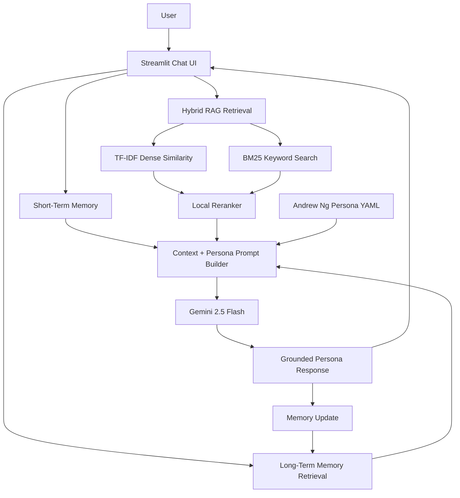

# Architecture

The system combines two context channels before generation:

- Knowledge context from RAG over local corpus chunks.
- Personal context from short-term and long-term memory.

The persona layer is applied after retrieval so the final response can be both grounded and stylistically consistent.
